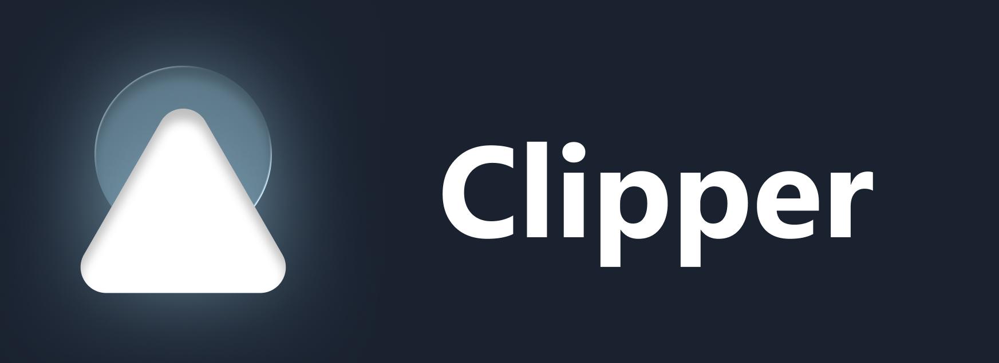

# Clipper

<p align="center">
    
</p>

Clipper is an agentic video editor framework for TypeScript-authored motion graphics. It combines an Electron desktop shell, a Vite/React editor, and project-owned composition source files so motion graphics can be authored, previewed, organized, and exported from one local workspace.

Note: The app is still in development and is unsigned. I haven't bought the development certificate yet 😅

## Features

- TypeScript-authored composition sources using Clipper's component-oriented composition API.
- Desktop editor built with Electron, React, Vite, Tailwind CSS, Monaco Editor, and Zustand.
- Project file management for compositions, timelines, assets, and persisted editor state.
- Timeline editing for layered clips, motion markers, adjustment layers, selection, resizing, and playback previews.
- Media export pipeline with configurable resolution, frame rate, format, tiling, and worker settings.
- Cross-platform packaging through electron-builder for macOS, Windows, and Linux.

## Requirements

- Node.js 20 or newer is recommended.
- npm is used by the checked-in `package-lock.json`.
- A desktop environment capable of running Electron.
- Platform build prerequisites for `electron-builder` when creating installers for macOS, Windows, or Linux.

## Getting Started

Install dependencies:

```bash
npm install
```

Start the desktop app in development mode:

```bash
npm run dev
```

The development command starts the Vite renderer on `127.0.0.1:5173`, watches the Electron main-process TypeScript build, waits for both targets, and then launches Electron.

## Development Scripts

- `npm run dev` starts the full Electron development environment.
- `npm run renderer:dev` starts only the Vite renderer dev server.
- `npm run electron:dev` runs the renderer, Electron TypeScript watcher, and Electron app together.
- `npm run typecheck` type-checks both renderer/project code and Electron code.
- `npm run test` runs the Vitest test suite.
- `npm run icons:generate` regenerates packaged application icons.
- `npm run build` type-checks, builds the Vite renderer into `dist`, and compiles Electron code into `dist-electron`.
- `npm run dist` builds distributable packages with electron-builder.
- `npm run dist:mac`, `npm run dist:win`, and `npm run dist:linux` build platform-specific packages.

## Project Structure

```text
clipper/
├── clipper/                    # Local app workspace: projects, exports, and persisted app state
├── electron/                   # Electron main process, preload scripts, and render/export engine
├── src/                        # React renderer application
│   ├── app/                    # App state, project services, feature controllers, and editor logic
│   ├── components/             # Shared editor UI components
│   ├── core/                   # Pure timeline, composition, export, and render domain helpers
│   ├── lib/                    # Shared utility modules
│   ├── App.tsx                 # Renderer app entry component
│   ├── main.tsx                # React renderer bootstrap
│   └── styles.css              # Tailwind and global styles
├── scripts/                    # Maintenance scripts such as icon generation
├── build/                      # Packaging resources and generated icons
├── agent-log/                  # Versioned project plans and implementation memory
├── electron-builder.config.cjs # Packaging configuration
├── vite.config.ts              # Vite, Vitest, Tailwind, and dev filesystem bridge configuration
├── tsconfig.json               # Renderer and project TypeScript configuration
└── tsconfig.node.json          # Electron TypeScript configuration
```

## Composition Authoring

Composition source files live in the project workspace under `clipper/projects`. They should use Clipper's component-oriented TypeScript authoring style with `new Composition({ render() { return [...] } })` and renderable classes such as `Component`, `Group`, `Rect`, `Text`, and `Chart`.

Do not author public composition sources as normalized object-list JSON. The normalized `CompositionClip.objects` representation is internal editor/runtime state.

## Building And Distribution

Run a production build before packaging:

```bash
npm run build
```

Create distributable packages for the current platform:

```bash
npm run dist
```

Platform-specific packaging commands are available with `npm run dist:mac`, `npm run dist:win`, and `npm run dist:linux`. Packaging is configured in `electron-builder.config.cjs` with app id `app.clipper.editor`, product name `Clipper`, and build resources from `build/electron`.

Generated build output is written to `dist` and `dist-electron`; packaged artifacts are produced by electron-builder according to its default output conventions and the local platform/toolchain.

## Contributing

Contributions are welcome. To keep the project maintainable:

- Keep changes focused and minimal.
- Run `npm run typecheck` and `npm run test` before opening a pull request.
- Reuse existing React components and themed UI primitives where possible.
- Keep shared editor/project state in the existing scoped Zustand stores instead of adding deep prop chains.
- Place reusable domain logic in `src/core` or focused modules under `src/app` rather than growing large React components.
- Add effects through package manifests, logic modules, category/timeline metadata, post-process declarations, and in-process registry APIs documented in `docs/EFFECT_PACKAGES.md`; do not hardcode effect-specific UI/timeline/export branches or imply an npm/plugin loader exists.
- Preserve the class/render-based composition authoring API for project-owned source files.
- Update the relevant versioned memory file under `agent-log/` when making project changes.

## License

Clipper is licensed under the MIT License. See [LICENSE](LICENSE) for details.
